# Характеристики ВМ:
- Общий объем оперативной памяти: 465 МБ
- Объем раздела подкачки: 819 МБ
- Размер виртуальной страницы: 4096 байт
- Объем свободной физической памяти в ненагруженной системе: 355 МБ (available) 310 МБ (free)
- Объем свободного пространства в разделе подкачки в ненагруженной системе: 742 МБ

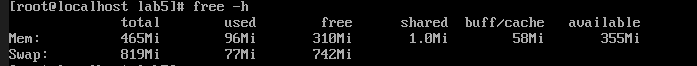

## Эксперимент 1

### Первый этап

- dmesg | grep "mem.bash"
    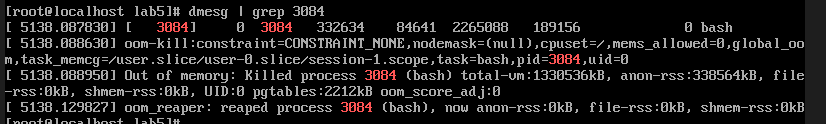
- Последняя запись report.log:
    counter: 1300000 size: 13000000

#### Графики
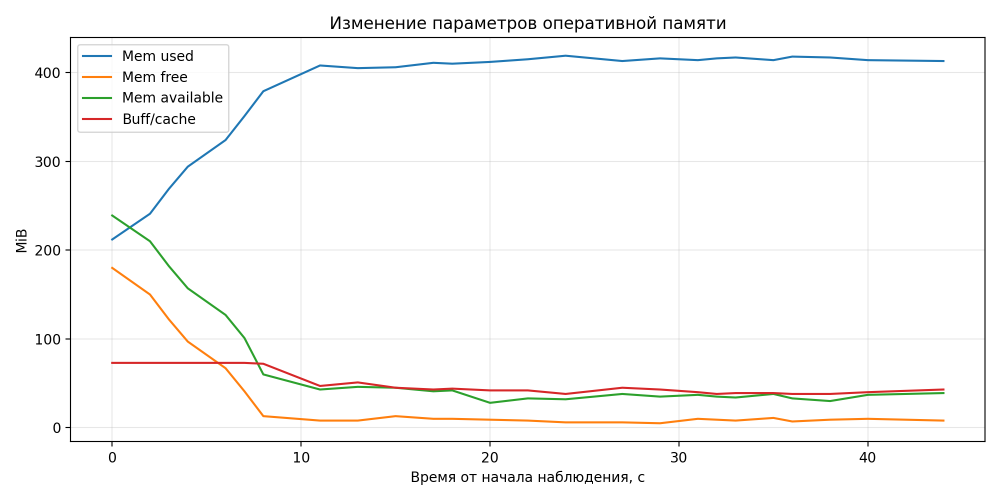
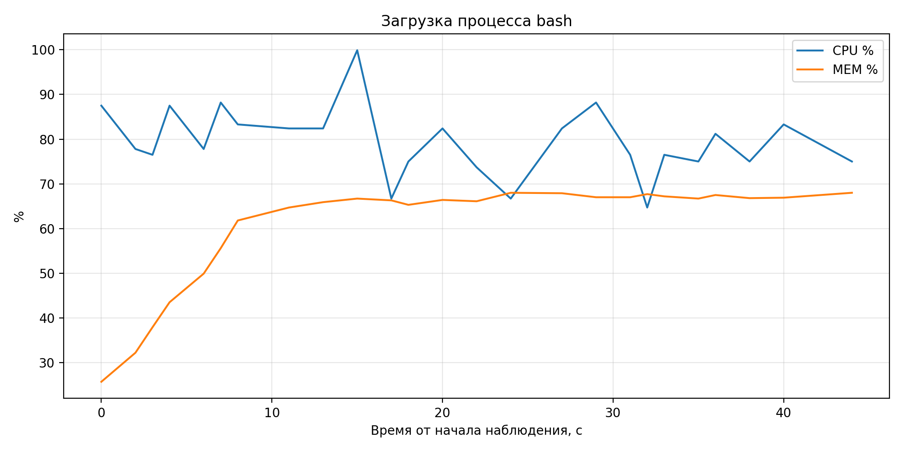
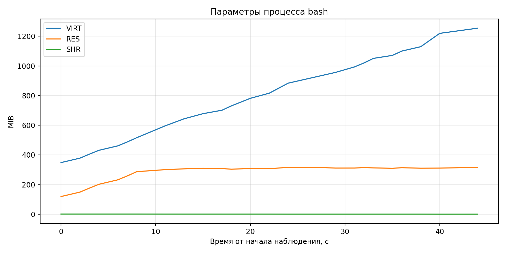
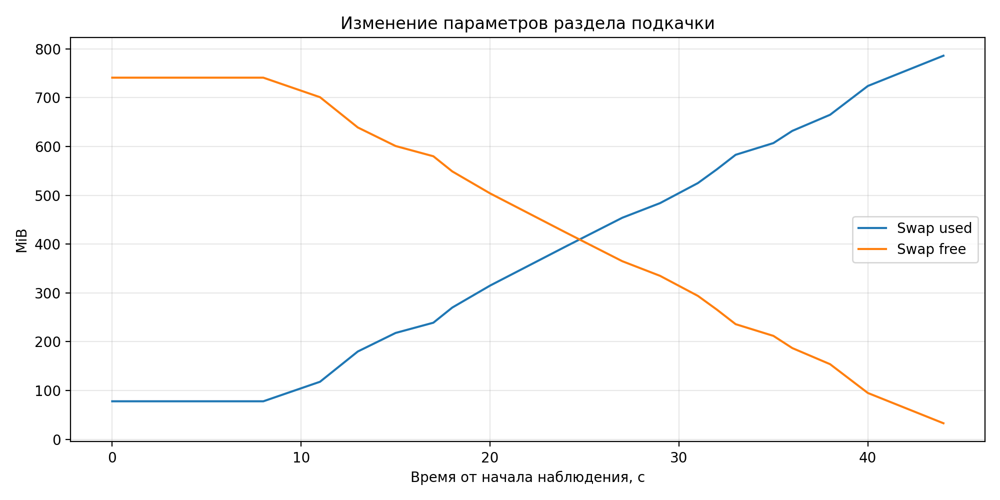

### Второй этап
- dmesg | grep "mem.bash"
    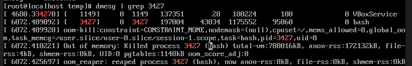
- dmesg | grep "mem2.bash"
    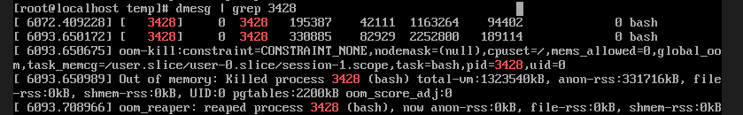
- Последняя запись report.log:
    counter: 700000 size: 7000000
- Последняя запись report2.log:
    counter: 1300000 size: 13000000

#### Графики
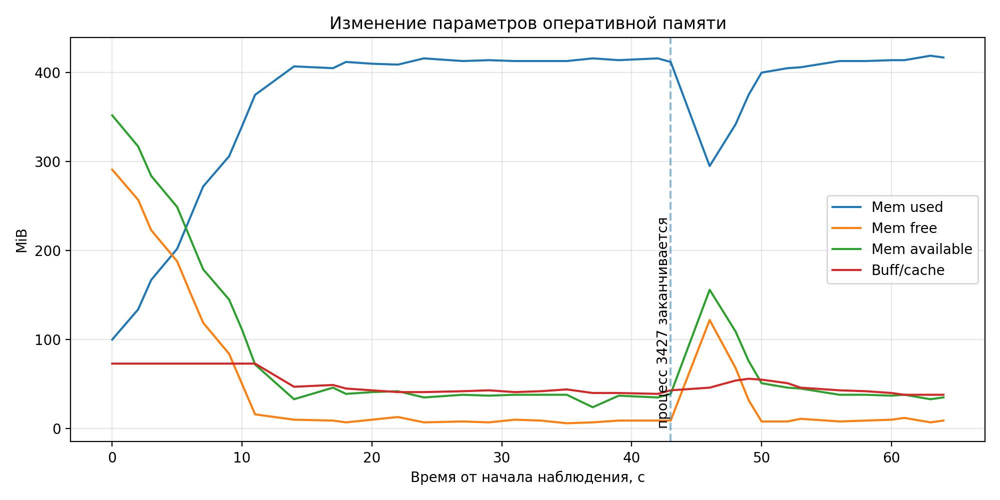
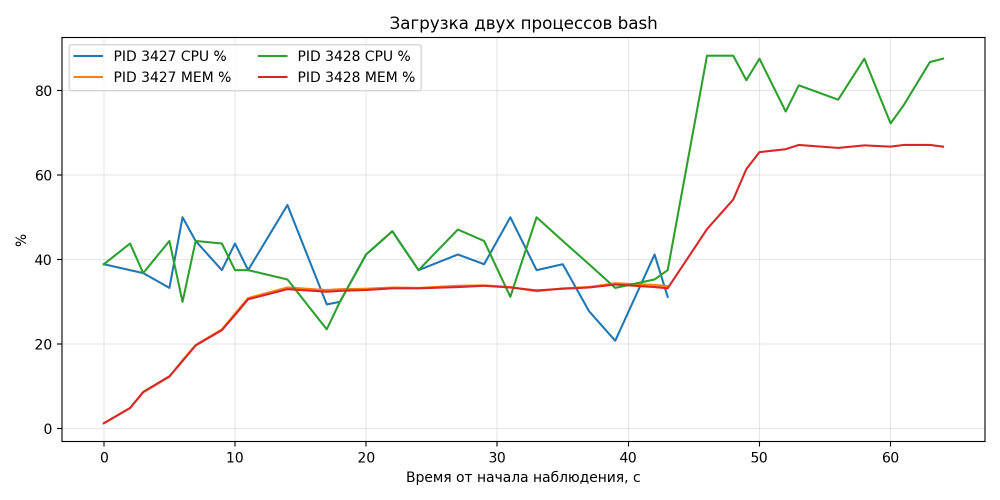
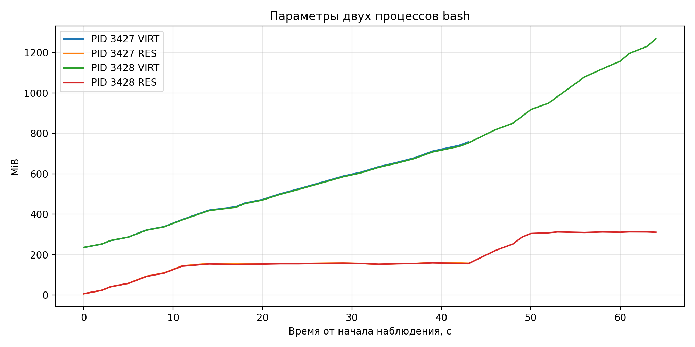
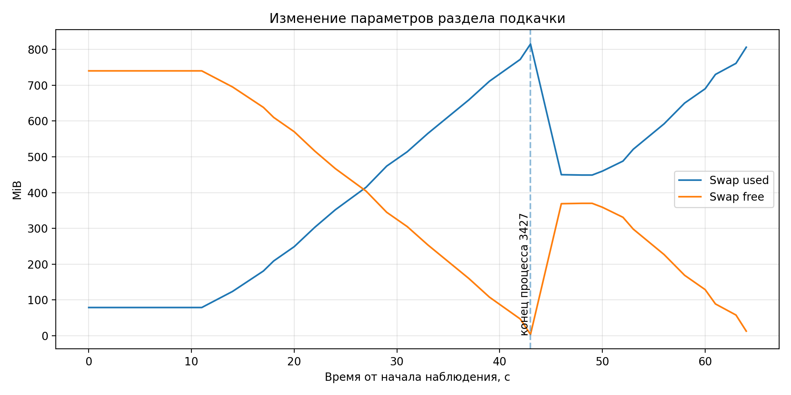

Выводы: После того, как процесс убивается, его ресуры освобождаются не мгновенно, ОС какое-то время ждет, чтобы передать эти ресурсы другому процессу

## Эксперимент 2
В моем случае все программы завершаются успешно.

Но я думаю, что они могут завершаться аварийно, поскольку память процессам дается странично, и чем больше процессов будет тем больше неиспользованной памяти будет, что может привести к ее переполнению